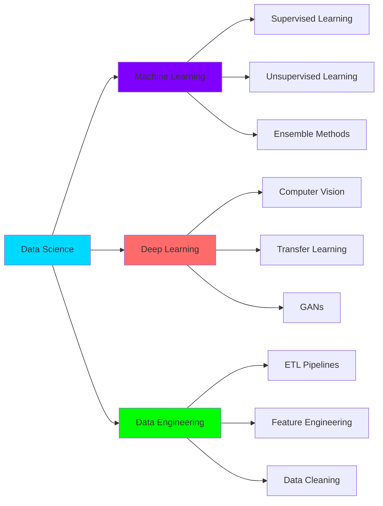

<div align="center">


[](https://git.io/typing-svg)

<p>
<a href="mailto:amirthaganeshramesh@gmail.com"></a>
<a href="https://github.com/Data-pageup"></a>
<a href="https://linkedin.com/in/amirthaganeshramesh"></a>

</p>

</div>

---

## 🎓 EDUCATION

<table>
<tr>
<td width="50%">

<br><b>Vellore Institute of Technology, AP</b>
<br>CGPA: 8.43/10.0 | Present
</td>
<td width="50%">

<br><b>Sharda University, Delhi</b>
<br>CGPA: 7.85/10.0 | Graduated
</td>
</tr>
</table>

---

## 💼 EXPERIENCE

<details open>
<summary><b>🏢 Data Analyst Intern @ White Elephant | Bangalore</b></summary>
<br>

```yaml
Duration: Jun 2022 – Jul 2022
Impact:
  - Data Quality Improvement: 85% ↑
  - Feature Space Reduction: 40% ↓ (preserved 92% variance)
  - Model Accuracy Boost: 12% ↑
  - Data Inconsistencies: 78% ↓

Technologies: PCA, t-SNE, Regularization, Preprocessing Pipelines
Dataset Scale: 1K - 100K+ records
```

**Key Achievements:**
- 📊 Analyzed large-scale datasets for consultancy use-cases
- 🔬 Applied dimensionality reduction techniques (PCA, t-SNE)
- ⚙️ Implemented bias-variance optimization strategies
- 🛠️ Built robust preprocessing pipelines for data cleaning

</details>

---

## 📚 RESEARCH & PUBLICATIONS

<div align="center">

**🔬 IEEE CICN 2025 | NIT Goa**

</div>

> **"Dimensionality Reduction for Intrusion Detection Using Crow Search Optimization and Grey Wolf Optimization"**
> 
> *Amirthaganesh Ramesh*

```diff
+ Proposed metaheuristic feature selection methods
+ Achieved state-of-the-art detection performance
+ Evaluated on benchmark IDS datasets
+ 17th IEEE International Conference (CICN 2025)
```

---

## 🚀 FEATURED PROJECTS

<div align="center">

### 🌟 PORTFOLIO HIGHLIGHTS 🌟

</div>

<table>
<tr>
<td width="50%" valign="top">

### 🧬 Hybrid GAN-Copula Synthesizer
[](https://github.com/Data-pageup)

**Dual-Engine Synthetic Data Generator**

🎯 **Tech Stack:**
- Gaussian Copula
- CTGAN (Conditional Tabular GAN)
- Streamlit Deployment

🔧 **Features:**
- Automated preprocessing & type detection
- Missing value imputation
- High-cardinality handling

📊 **Evaluation:**
- KS Statistic
- JS Divergence
- Correlation MSE
- ML Utility Checks
- Privacy Assessments

</td>
<td width="50%" valign="top">

### ♻️ EcoWaste AI
[](https://github.com/Data-pageup)

**Predictive Waste Sorting & CO2 Optimizer**

🎯 **Performance:**
- **88.8%** Test Accuracy
- **25K+** Images Processed
- **R² = 0.96** for CO2 Prediction

🔧 **ML Pipeline:**
- MobileNetV2 Transfer Learning
- RandomForest Regressor
- K-Means Clustering (3 clusters)

🌍 **Impact:**
- Organic vs Recyclable Classification
- CO2 Savings Prediction
- Personalized Sustainability Insights

</td>
</tr>
<tr>
<td width="50%" valign="top">

### 💪 SmartFit AI
[](https://github.com/Data-pageup)

**ML-Powered Fitness Analytics Platform**

🎯 **Data Scale:**
- **20K+** Fitness Records
- **5** Fitness Archetypes

🔧 **ML Techniques:**
- PCA for Dimensionality Reduction
- K-Means Clustering
- Neural Networks (Calorie/BMI/Body-fat)

📱 **Features:**
- Real-time Predictions
- AI Workout Schedules
- Personalized Diet Plans
- Interactive Streamlit Dashboard

</td>
<td width="50%" valign="top">

### 💧 RippleWorks
[](https://github.com/Data-pageup)

**Water Quality Intelligence System**

🎯 **Models:**
- XGBoost Regressor (WQI)
- XGBoost Classifier (WQC)

🔧 **Engineering:**
- Feature-engineered WQI & WQC
- KNN Imputation
- IQR Capping

🌊 **Application:**
- Real-time Water Quality Analysis
- Streamlit Web Interface
- Interactive User Experience

</td>
</tr>
</table>

---

## 🛠️ TECHNICAL ARSENAL

<div align="center">

### **💻 Programming & Core**


### **🤖 Machine Learning**


### **🧠 Deep Learning**


**Architectures:** CNN • RNN • LSTM • GRU • GANs • Transfer Learning

### **📊 Data Science & Analytics**


**Specialties:** Statistical Modeling • A/B Testing • Time Series (ARIMA/SARIMA) • Feature Engineering • NLP • Computer Vision

### **🔧 Tools & Deployment**


</div>

---

## 🏆 CERTIFICATIONS

<table>
<tr>
<td align="center" width="33%">

<br><b>OCI Data Science Professional</b>
<br><sub>Oracle University (2025)</sub>
</td>
<td align="center" width="33%">

<br><b>ML Foundations</b>
<br><sub>University of Washington (2025)</sub>
</td>
<td align="center" width="33%">

<br><b>Data Science & Analytics</b>
<br><sub>HP LIFE Foundation (2025)</sub>
</td>
</tr>
</table>

---

## 📈 EXPERTISE MATRIX



---

## 💡 CORE COMPETENCIES

<div align="center">

| 🎯 Domain | 🔧 Capabilities | 📊 Impact |
|-----------|----------------|-----------|
| **ML Engineering** | Production Pipelines, Model Optimization | Scalable Solutions |
| **Computer Vision** | Image Classification, Object Detection | 88.8% Accuracy |
| **Data Processing** | ETL, Feature Engineering, Cleaning | 85% Quality Improvement |
| **Analytics** | Statistical Modeling, A/B Testing | Data-Driven Insights |
| **Deployment** | Streamlit, Docker, MLflow | End-to-End Systems |

</div>

---

## 🌟 WHAT DRIVES ME

<div align="center">

```
┌─────────────────────────────────────────────────────────────┐
│  "Building AI systems that solve real-world problems        │
│   and create measurable impact through innovation."         │
└─────────────────────────────────────────────────────────────┘
```

**Focus Areas:**
🌍 Environmental AI • 🔬 Research & Innovation • 📊 Production ML • 🚀 Scalable Solutions

</div>

---

## 📬 LET'S COLLABORATE

<div align="center">

**Open to exciting opportunities in Data Science, ML Engineering, and AI Research**

<p>
<a href="mailto:amirthaganeshramesh@gmail.com">

</a>
<a href="https://linkedin.com/in/amirthaganeshramesh">

</a>
<a href="https://github.com/Data-pageup">

</a>
</p>

<br>

**🔥 Current Status:** Actively building, learning, and shipping ML solutions


</div>
