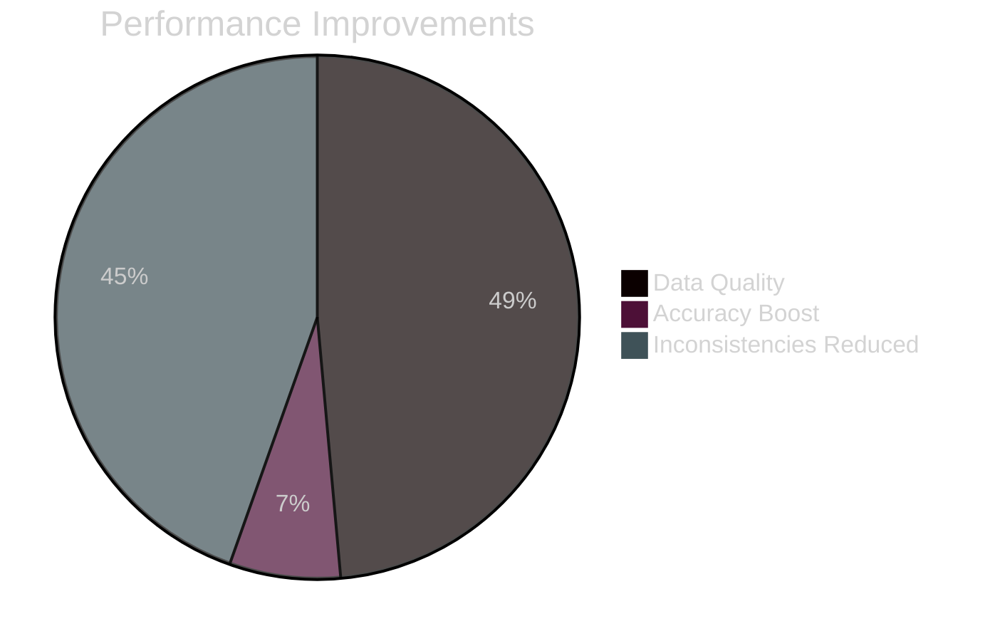
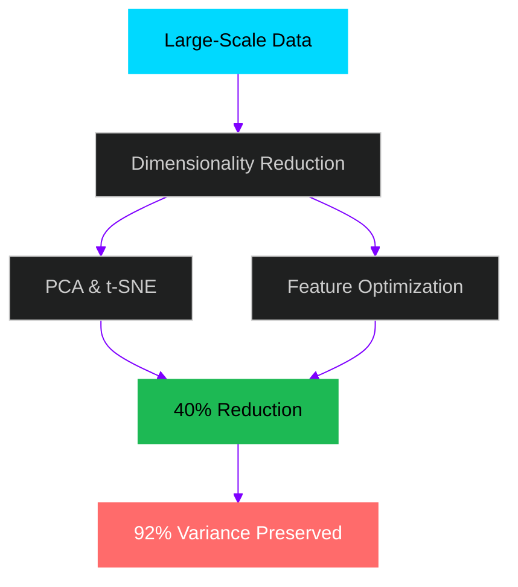
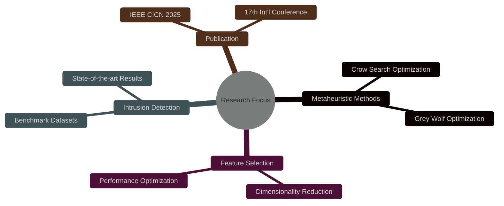
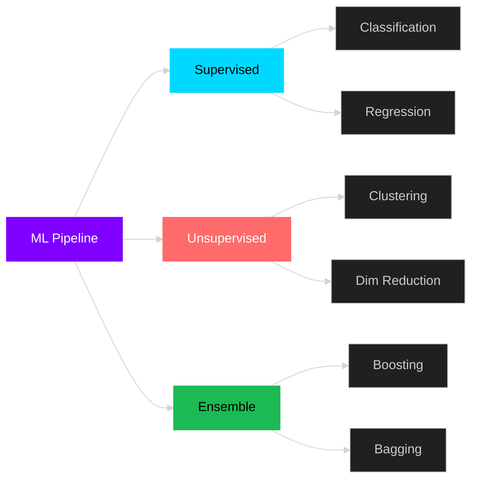
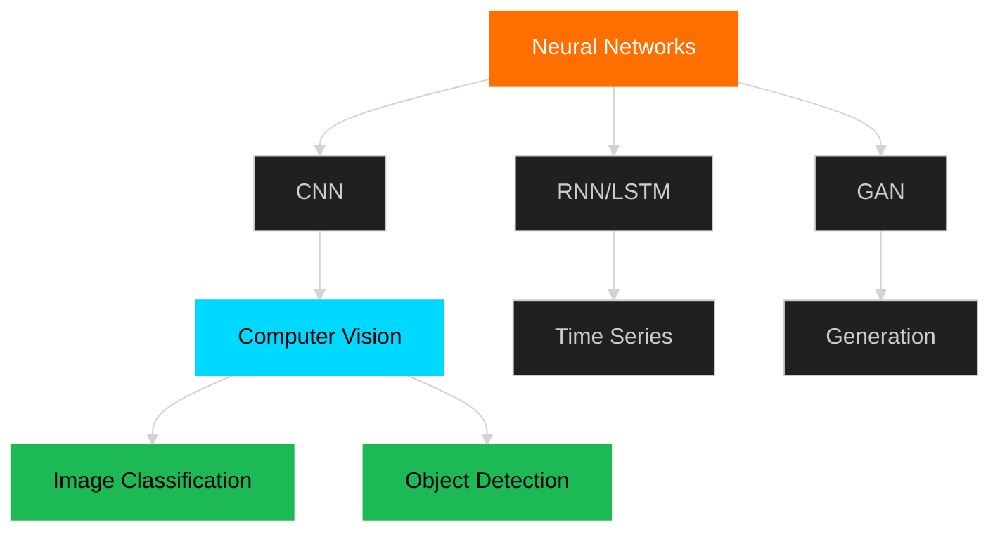
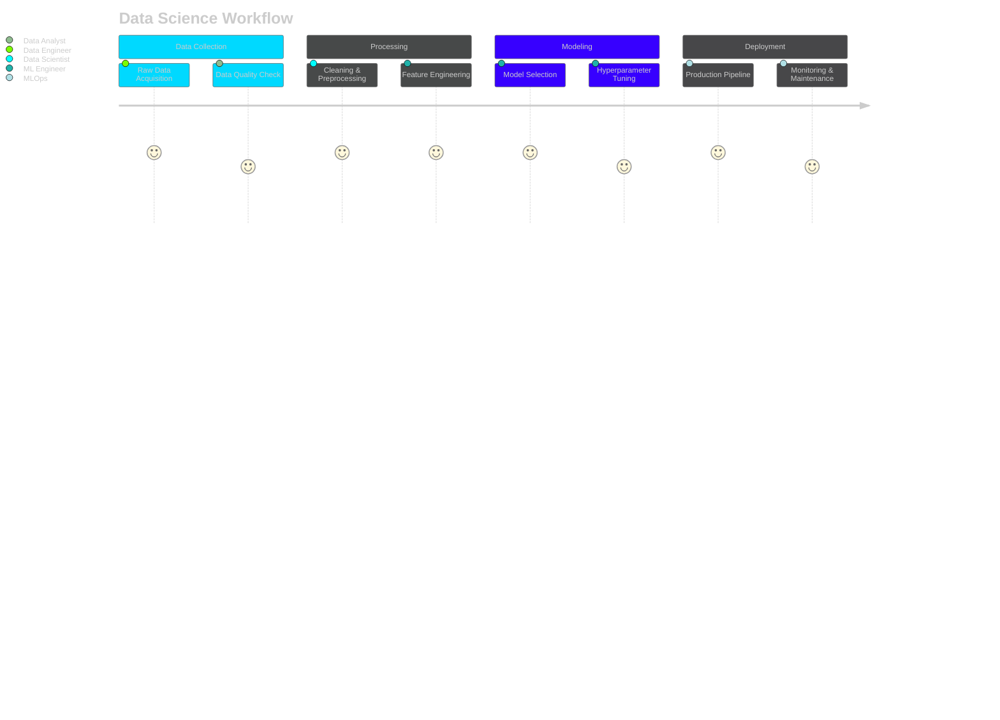
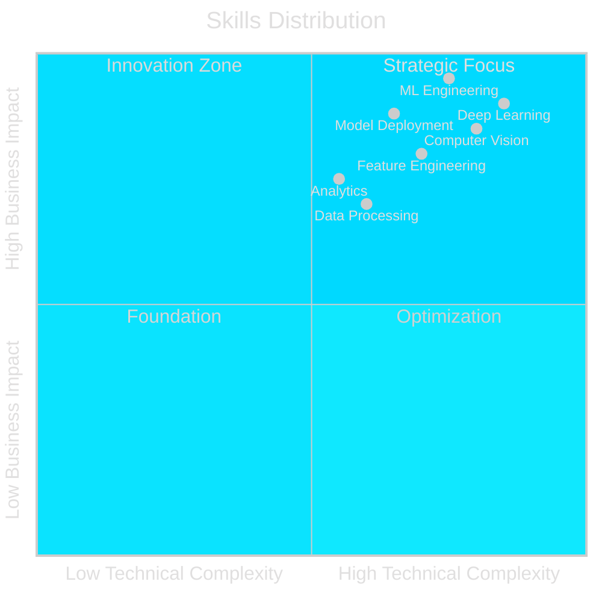

---

## 🎓 EDUCATION

<table>
<tr>
<td width="50%">

 <b>Vellore Institute of Technology, AP</b>
 CGPA: 8.43/10.0 | Present
</td>
<td width="50%">

 <b>Sharda University, Delhi</b>
 CGPA: 7.85/10.0 | Graduated
</td>
</tr>
</table>

---

## 💼 EXPERIENCE

### 🏢 Data Analyst Intern @ White Elephant | Bangalore
**Jun 2022 – Jul 2022**

 

<table>
<tr>
<td width="50%" align="center">

### 📊 IMPACT METRICS

</td>
<td width="50%" align="center">

### 🎯 KEY ACHIEVEMENTS

</td>
</tr>
</table>

**Technologies:** PCA • t-SNE • Regularization • Preprocessing Pipelines  
**Dataset Scale:** 1K - 100K+ records

---

## 📚 RESEARCH & PUBLICATIONS

### 🔬 IEEE CICN 2025 | NIT Goa

**"Dimensionality Reduction for Intrusion Detection Using Crow Search Optimization and Grey Wolf Optimization"**

*Amirthaganesh Ramesh*

 

---

## 🛠️ TECHNICAL ARSENAL

### **💻 Programming & Core**

<table>
<tr>
<td width="50%" valign="top">

### 🤖 Machine Learning

</td>
<td width="50%" valign="top">

### 🧠 Deep Learning

**Architectures:**  
CNN • RNN • LSTM • GRU  
GANs • Transfer Learning

</td>
</tr>
</table>

### 📊 Data Science & Analytics

**Specialties:** Statistical Modeling • A/B Testing • Time Series (ARIMA/SARIMA) • Feature Engineering • NLP • Computer Vision

 

### 🔧 Tools & Deployment

---

## 🏆 CERTIFICATIONS

<table>
<tr>
<td align="center" width="33%">

 <b>OCI Data Science Professional</b>
 Oracle University (2025)
</td>
<td align="center" width="33%">

 <b>ML Foundations</b>
 University of Washington (2025)
</td>
<td align="center" width="33%">

 <b>Data Science & Analytics</b>
 HP LIFE Foundation (2025)
</td>
</tr>
</table>

---

## 📈 EXPERTISE MATRIX

```mermaid
%%{init: {'theme':'dark','themeVariables': {'darkMode':'true','background':'#0d1117','primaryColor':'#00D9FF','primaryTextColor':'#fff','primaryBorderColor':'#00D9FF','lineColor':'#7F00FF','secondaryColor':'#FF6B6B','tertiaryColor':'#1DB954'}}}%%
graph TB
    A[Data Science Expertise] --> B[Machine Learning]
    A --> C[Deep Learning]
    A --> D[Data Engineering]
    A --> E[Analytics]
    
    B --> B1[Supervised Learning]
    B --> B2[Unsupervised Learning]
    B --> B3[Ensemble Methods]
    B1 --> B1A[Classification]
    B1 --> B1B[Regression]
    B2 --> B2A[Clustering]
    B2 --> B2B[Dimensionality Reduction]
    B3 --> B3A[XGBoost]
    B3 --> B3B[Random Forest]
    
    C --> C1[Computer Vision]
    C --> C2[Transfer Learning]
    C --> C3[GANs]
    C1 --> C1A[Image Classification]
    C1 --> C1B[Object Detection]
    
    D --> D1[ETL Pipelines]
    D --> D2[Feature Engineering]
    D --> D3[Data Cleaning]
    
    E --> E1[Statistical Modeling]
    E --> E2[A/B Testing]
    E --> E3[Time Series Analysis]
    
    style A fill:#00D9FF,stroke:#00D9FF,color:#000,stroke-width:3px
    style B fill:#7F00FF,stroke:#7F00FF,color:#fff
    style C fill:#FF6B6B,stroke:#FF6B6B,color:#fff
    style D fill:#1DB954,stroke:#1DB954,color:#000
    style E fill:#FFD700,stroke:#FFD700,color:#000
```

---

## 🌟 WHAT DRIVES ME

<table>
<tr>
<td align="center" width="100%">
 
<h3>💭 Mission</h3>

<i>"Building AI systems that solve real-world problems and create measurable impact through innovation."</i>

 
</td>
</tr>
</table>

 

 

**🎯 Focus Areas**

---

## 📬 LET'S COLLABORATE

 

<table>
<tr>
<td align="center" width="100%">
 
<h3>🤝 Open to Opportunities</h3>

Excited about opportunities in <b>Data Science</b>, <b>ML Engineering</b>, and <b>AI Research</b>

 

 

<b>📍 Current Status:</b> <code>Actively building, learning, and shipping ML solutions</code>

 
</td>
</tr>
</table>

 

