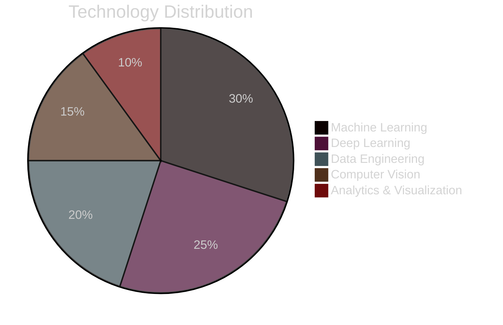

<div align="center">


[](https://git.io/typing-svg)

<p>
<a href="mailto:amirthaganeshramesh@gmail.com"></a>
<a href="https://github.com/Data-pageup"></a>
<a href="https://linkedin.com/in/amirthaganeshramesh"></a>

</p>

</div>

---

## 👨‍💻 ABOUT ME

<div align="center">


</div>

<br>

<div align="center">
<table>
<tr>
<td>

```javascript
const amirthaganesh = {
    role: "Data Scientist & ML Engineer",
    location: "India 🇮🇳",
    education: "M.Sc Data Science @ VIT AP",
    interests: [
        "Machine Learning",
        "Deep Learning", 
        "Computer Vision",
        "AI Research"
    ],
    currentFocus: "Building production-ready ML systems",
    motto: "Turning data into decisions, models into impact!"
};
```

</td>
</tr>
</table>
</div>

---

## 🎓 EDUCATION

<table>
<tr>
<td width="50%">

<br><b>Vellore Institute of Technology, AP</b>
<br>CGPA: 8.43/10.0 | Present
</td>
<td width="50%">

<br><b>Sharda University, Delhi</b>
<br>CGPA: 7.85/10.0 | Graduated
</td>
</tr>
</table>

---

## 💼 EXPERIENCE

**Data Analyst Intern** @ White Elephant | Bangalore  
`Jun 2022 – Jul 2022`

---

## 📚 RESEARCH

**IEEE CICN 2025** | NIT Goa  
*"Dimensionality Reduction for Intrusion Detection Using Crow Search Optimization and Grey Wolf Optimization"*

---

## 🛠️ TECHNICAL SKILLS

<div align="center">

### **💻 Programming & Core**


### **🤖 Machine Learning & Deep Learning**


### **📊 Data Science & Visualization**


### **🔧 Tools & Deployment**


</div>

---

## 📊 SKILLS OVERVIEW

```mermaid
%%{init: {'theme':'dark','themeVariables': {'primaryColor':'#00D9FF','primaryTextColor':'#ffffff','primaryBorderColor':'#00D9FF','lineColor':'#00D9FF','secondaryTextColor':'#ffffff','tertiaryTextColor':'#ffffff'}}}%%
graph TD
    DS[🎯 Data Science Expertise]
    
    DS --> ML[🤖 Machine Learning]
    DS --> DL[🧠 Deep Learning]
    DS --> DE[⚙️ Data Engineering]
    DS --> AN[📊 Analytics]
    
    ML --> ML1[Supervised Learning]
    ML --> ML2[Unsupervised Learning]
    ML --> ML3[Ensemble Methods]
    ML --> ML4[XGBoost & LightGBM]
    
    DL --> DL1[Computer Vision]
    DL --> DL2[CNN & Transfer Learning]
    DL --> DL3[GANs]
    DL --> DL4[RNN & LSTM]
    
    DE --> DE1[ETL Pipelines]
    DE --> DE2[Feature Engineering]
    DE --> DE3[Data Cleaning]
    DE --> DE4[Big Data Processing]
    
    AN --> AN1[Statistical Modeling]
    AN --> AN2[A/B Testing]
    AN --> AN3[Time Series Analysis]
    AN --> AN4[Data Visualization]
    
    style DS fill:#00D9FF,stroke:#00D9FF,stroke-width:4px,color:#000
    style ML fill:#7F00FF,stroke:#7F00FF,stroke-width:3px,color:#fff
    style DL fill:#FF6B6B,stroke:#FF6B6B,stroke-width:3px,color:#fff
    style DE fill:#00FF00,stroke:#00FF00,stroke-width:3px,color:#000
    style AN fill:#FFD700,stroke:#FFD700,stroke-width:3px,color:#000
```



---

## 🚀 MY DATA SCIENCE WORKFLOW

<div align="center">

**From Raw Data to Production-Ready Models**

```mermaid
%%{init: {'theme':'dark','themeVariables': {'primaryColor':'#00D9FF','primaryTextColor':'#ffffff','primaryBorderColor':'#00D9FF','lineColor':'#00D9FF','secondaryColor':'#FF6B6B','tertiaryColor':'#00FF00','textColor':'#ffffff','fontSize':'14px'}}}%%
flowchart LR
    A["📥 Data Collection<br/><small>APIs, Databases, Files</small>"] --> B["🧹 Data Cleaning<br/><small>Handle Missing Values</small>"]
    B --> C["🔍 EDA & Visualization<br/><small>Insights Discovery</small>"]
    C --> D["⚙️ Feature Engineering<br/><small>Create & Select Features</small>"]
    D --> E["🤖 Model Development<br/><small>Train & Experiment</small>"]
    E --> F["📊 Evaluation & Tuning<br/><small>Optimize Performance</small>"]
    F --> G["🚀 Deployment<br/><small>Production Ready</small>"]
    G --> H["📈 Monitoring<br/><small>Track & Improve</small>"]
    
    style A fill:#00D9FF,stroke:#00D9FF,color:#000,stroke-width:3px
    style B fill:#7F00FF,stroke:#7F00FF,color:#fff,stroke-width:3px
    style C fill:#FF6B6B,stroke:#FF6B6B,color:#fff,stroke-width:3px
    style D fill:#00FF00,stroke:#00FF00,color:#000,stroke-width:3px
    style E fill:#FF6F00,stroke:#FF6F00,color:#fff,stroke-width:3px
    style F fill:#F2C811,stroke:#F2C811,color:#000,stroke-width:3px
    style G fill:#E97627,stroke:#E97627,color:#fff,stroke-width:3px
    style H fill:#0077B5,stroke:#0077B5,color:#fff,stroke-width:3px
```

</div>



---

## 🏆 CERTIFICATIONS

<div align="center">

| Oracle | Coursera | HP LIFE |
|:------:|:--------:|:-------:|
| **OCI Data Science Professional** | **ML Foundations** | **Data Science & Analytics** |
| Oracle University (2025) | University of Washington (2025) | HP LIFE Foundation (2025) |

</div>

---

## 🎯 FOCUS AREAS

<div align="center">



</div>

---

## 💡 CURRENT FOCUS

<div align="center">

| 🔬 Research | 🚀 Building | 📚 Learning |
|------------|------------|------------|
| Optimization Algorithms | Production ML Pipelines | Advanced DL Architectures |
| Intrusion Detection | AI Solutions | MLOps & Deployment |

</div>

---

## 📬 LET'S CONNECT

<div align="center">

<table>
<tr>
<td align="center" width="100%">
<br>
<h3>🤝 Open to Opportunities</h3>
<p>Interested in <b>Data Science</b>, <b>ML Engineering</b>, and <b>AI Research</b> roles</p>
<br>
<p>
<a href="mailto:amirthaganeshramesh@gmail.com">

</a>
<a href="https://linkedin.com/in/amirthaganeshramesh">

</a>
<a href="https://github.com/Data-pageup">

</a>
</p>
<br>
</td>
</tr>
</table>

<br>


</div>
