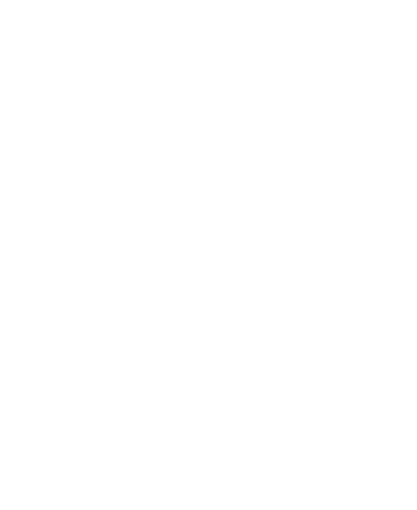

<table>
<tr>

<td width="40%" valign="middle">

<picture>
  <source media="(prefers-color-scheme: dark)" srcset="ascii-dark.png">
  <source media="(prefers-color-scheme: light)" srcset="ascii-light.png">
  
</picture>

</td>

<td width="60%" valign="middle">

I take projects from raw data to production: cleaning, embeddings, RAG systems and agentic workflows, with real MLOps behind them. Currently looking for a Data Science role. Let's build something impactful.

🌱 <b>Currently:</b> building agentic AI systems and RAG pipelines 
👀 <b>Open to:</b> Data Science / ML Engineer roles 
💬 <b>Ask me about:</b> LLM pipelines, RAG, agents, classical ML

🏆 IEEE Published Researcher 
☁️ Oracle Cloud Data Science Professional 2025 
🤖 Oracle Agentic AI Certified Foundations Associate

🌐 <a href="https://github.com/Data-pageup">GitHub</a> •
<a href="https://www.linkedin.com/in/amirthaganeshramesh">LinkedIn</a> •
<a href="https://data-pageup.github.io/AmirthaganeshR">Portfolio</a> 
📧 <a href="mailto:amirthaganeshramesh@gmail.com">amirthaganeshramesh@gmail.com</a>

</td>

</tr>
</table>

## Featured Projects

- **GoAnywhere AI**: multi-agent travel planner built with LangGraph and FastAPI. [GitHub](https://github.com/Data-pageup/goanywhere-ai-langgraph) · [Live Demo](https://goanywhere-ai.onrender.com/)
- **Corrective RAG**: privacy-aware hybrid retrieval that runs fully local on Ollama. [GitHub](https://github.com/Data-pageup/Corrective-RAG-with-Human-in-the-Loop)
- **Tamil LLM**: 23M-parameter Transformer built from scratch in PyTorch. [Hugging Face](https://huggingface.co/AG-dataScientist/tamil-llm-23m)
- **FIFA World Cup 2026 Prediction**: Poisson regression + 1,000 Monte Carlo simulations. [GitHub](https://github.com/Data-pageup/FIFA-2026-Outcome-Prediction-Using-Poisson-Regression-and-Monte-Carlo-Simulation)

More experience and projects on my [portfolio](https://data-pageup.github.io/AmirthaganeshR).

## Skills & Tools

<table>
<tr><td><b>Languages</b></td><td>

</td></tr>

<tr><td><b>ML &amp; Deep Learning</b></td><td>

</td></tr>

<tr><td><b>GenAI &amp; LLMs</b></td><td>

</td></tr>

<tr><td><b>Data &amp; BI</b></td><td>

</td></tr>

<tr><td><b>MLOps &amp; Cloud</b></td><td>

</td></tr>
</table>
